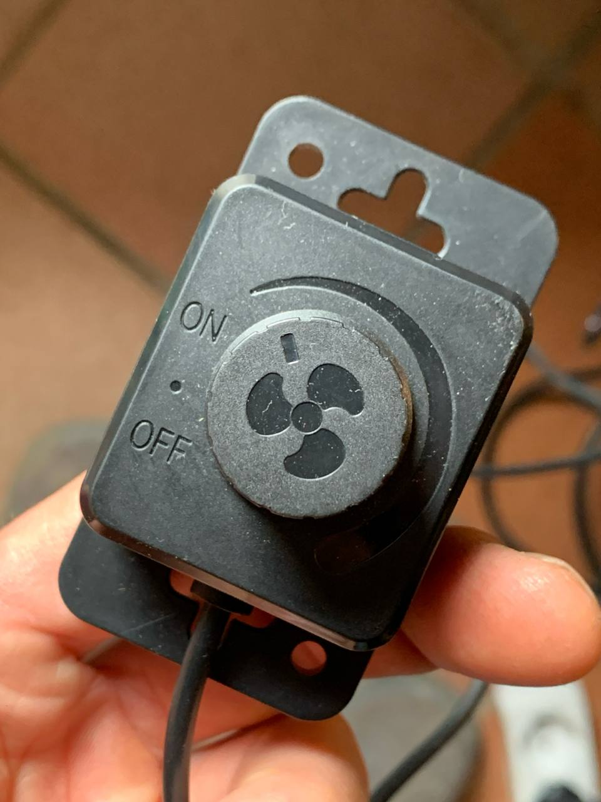
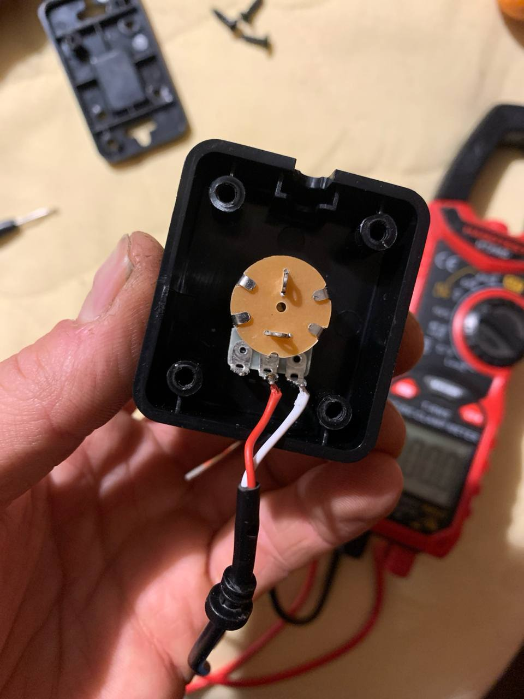
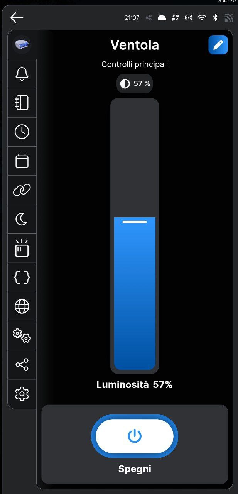

# 🏡HomeMiningAssistant

**Automazione del mining con Home Assistant e fotovoltaico**

HomeMiningAssistant è un progetto per ottimizzare il mining di Bitcoin **utilizzando l'energia in esubero dai pannelli fotovoltaici**, trasformando il calore dissipato dall’ASIC in riscaldamento per la casa. Il tutto viene gestito automaticamente con **Home Assistant**.

---

## 🚀Funzionalità

**Automazione completa** del mining e della ventilazione con Home Assistant  
**Integrazione con impianti fotovoltaici** per sfruttare solo l’energia in esubero.  
Uso di una **ventola da 200 mm** con convogliatore stampato in 3D per migliorare il raffreddamento e ridurre il rumore.

---

##  🛠️Requisiti

### Hardware
- ASIC per il mining di Bitcoin (ad esempio S19)
- Ventola da 200 mm con convogliatore stampato in 3D 
- Sensori di temperatura (opzionale per migliorare l’automazione)
- Raspberry Pi o altro dispositivo per eseguire Home Assistant
- Impianto fotovoltaico con sistema di monitoraggio della produzione

### Software
- Home Assistant
- Integrazione con il sistema di monitoraggio del fotovoltaico (es. Shelly, Victron, Tasmota...)
- Custom automation per la gestione dell'ASIC e della ventola

---
### Firmware ASIC
Per questo test è stato utilizzato il firmware di [Braiins](https://braiins.com/os-firmware) su un Antminer S19k Pro. E' stato scelto questo firmware perché consente la modalità cosiddetta *immersion mode* che consente di staccare fisicamente le ventole senza far andare in protezione il miner. Inoltre grazie ad [hass-miner](https://github.com/Schnitzel/hass-miner) risulta integrabile su Home Assistant.

---
### Preparare la ventola
Per questo esempio è stata utilizzato un estrattore assiale da 200 mm con controller manuale che per comodità chiameremo *ventolone* [Link](https://amzn.to/4gHcs22).<br>
<table align="center">
  <tr>
    <td align="center">
      <br>
      <small>Ventolone da 200mm</small>
    </td>
    <td align="center">
      <br>
      <small>Potenziometro manuale</small>
    </td>
  </tr>
</table>

Il controller manuale è stato automatizzato sostituendolo con un potenziometro domotico [Shelly Plus Dimmer 0-10 DC](https://amzn.to/4hUtlak).<br> 
Il comando manuale è un semplice potenziometro, per sostituirlo basta aprirlo, tagliare i cavi e metterli nello Shelly. Il cavo rosso andrà nel "-" mentre il bianco nel "+".<br>
Ovviamente lo shelly va alimentato con la tensione di 230V e si consiglia di usare una linea indipendente che rimane sempre alimentata.<br>

<table align="center">
  <tr>
    <td align="center">
      <br>
      <small>Interno del potenziometro</small>
    </td>
    <td align="center">
      <br>
      <small>Collegamento Shelly</small>
    </td>
  </tr>
</table>
Configura il dispositivo nell'app "Shelly Smart Control" chiamandolo "Ventola", ma sappi che nella logica dell'app il nuovo dispositivo viene interpretato come se fosse una lampadina dimmerabile.<br> 
Vai nelle impostazioni del dispositivo e modifica:

- **Impostazioni di ingresso/uscita** > Action on power on > configura il dispositivo Shelly per ripristinare l'ultima modalità in cui si trovava, quando è alimentato.
- **Luminosità minima con attivazione/disattivazione** > 100.
- **Luminosità minima/massima** > nel campo valore minimo bisogna inserire il valore minimo che la ventola supporta senza fermarsi, può variare da ventola a ventola. Il valore 10 generalemte è sufficiente.

Adesso la ventola risulterà comandabile da remoto attraverso l'app Shelly.
<table align="center">
  <tr>
    <td align="center">
      <br>
      <small>Interfaccia app per gestire il ventolone</small>
    </td>
  </tr>
</table>

---
### Integrazione con Home Assistant
Una volta installata l'integrazione [hass-miner](https://github.com/Schnitzel/hass-miner) ci accorgeremo che c'è una temperatura per ogni hashboard, quindi andiamo a creare un sensore virtuale che prenda il valore massimo.<br>
Apriamo il file `configuration.yaml` e aggiungiamo il sensore:
```yaml
sensor:
  - platform: template
    sensors:
      max_chip_temperature_s19kpro:
        friendly_name: "Max Chip Temperature S19kPro"
        unit_of_measurement: "°C"
        value_template: >
          {{ [
              states('sensor.antminer_s19kpro_board_0_chip_temperature') | float(0),
              states('sensor.antminer_s19kpro_board_1_chip_temperature') | float(0),
              states('sensor.antminer_s19kpro_board_2_chip_temperature') | float(0)
             ] | max }}
        icon_template: mdi:thermometer
```


---
## 📷Foto e Modelli 3D
 Aggiungi immagini del setup e link ai modelli 3D per il convogliatore della ventola.

---

## 📜Licenza
Questo progetto è rilasciato sotto la licenza **MIT**. Consulta il file [LICENSE](LICENSE) per maggiori dettagli.

---

##  🔗Link Utili
- [Home Assistant](https://www.home-assistant.io/)

---

##  Contributi e Feedback
I contributi sono benvenuti! Se hai suggerimenti o vuoi migliorare il progetto, apri una **issue** o un **pull request** su GitHub.

---

🚀 **Massimizza il mining, scalda la casa** ⚡
