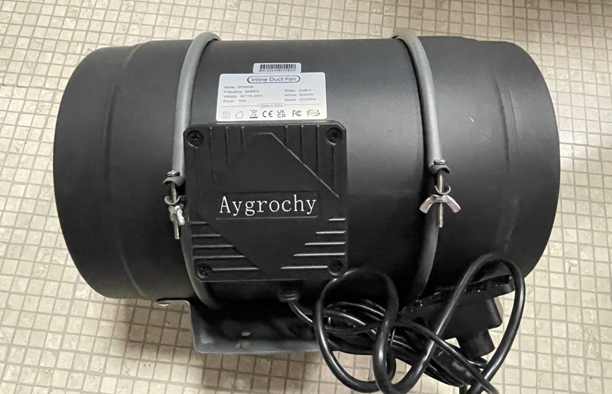
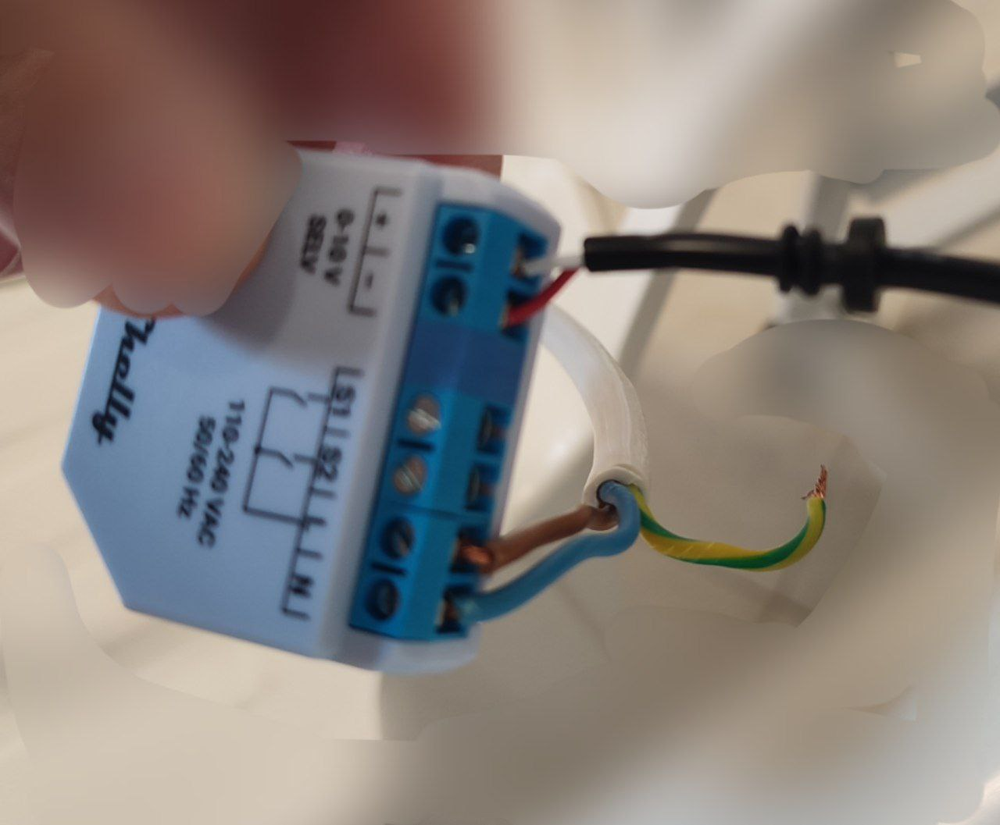

# HomeMiningAssistant

**Automazione del mining con Home Assistant e fotovoltaico**

HomeMiningAssistant è un progetto per ottimizzare il mining di Bitcoin **utilizzando l'energia in esubero dai pannelli fotovoltaici**, trasformando il calore dissipato dall’ASIC in riscaldamento per la casa. Il tutto viene gestito automaticamente con **Home Assistant**.

---

## Funzionalità

**Automazione completa** del mining e della ventilazione con Home Assistant  
**Integrazione con impianti fotovoltaici** per sfruttare solo l’energia in esubero.  
Uso di una **ventola da 200 mm** con convogliatore stampato in 3D per migliorare il raffreddamento e ridurre il rumore.

---

##  Requisiti

### Hardware
- ASIC per il mining di Bitcoin (ad esempio S19)
- Ventola da 200 mm con convogliatore stampato in 3D 
- Sensori di temperatura (opzionale per migliorare l’automazione)
- Raspberry Pi o altro dispositivo per eseguire Home Assistant
- Impianto fotovoltaico con sistema di monitoraggio della produzione

### Software
- Home Assistant
- Integrazione con il sistema di monitoraggio del fotovoltaico (es. Shelly, Victron, Tasmota...)
- Custom automation per la gestione dell'ASIC e della ventola

---
### Preparare la ventola
Per questo esempio è stata utilizzato un estrattore assiale da 200 mm con controller manuale [Link]((https://amzn.to/4gHcs22). 

Il controller manuale è stato automatizzato sostituendolo con un potenziometro domotico [Shelly Plus Dimmer - 0-10 DC](https://amzn.to/432Y94R). 
Il comando manuale è un semplice potenziometro, per sostituirlo basta aprirlo, tagliare i cavi e metterli nello Shelly. Il cavo rosso andrà nel "-" mentre il bianco nel "+". 
Ovviamente lo shelly va alimentato con la tensione di 230V e si consiglia di usare una linea indipendente che rimane sempre alimentata. 

Nelle impostazioni del dispositivo nell'app "Shelly Smart Control" modificare: 
- Impostazioni di ingresso/uscita > Action on power on > configura il dispositivo Shelly per ripristinare l'ultima modalità in cui si trovava, quando è alimentato. 
- Luminosità minima con attivazione/disattivazione > 100. 
- Luminosità minima/massima > nel campo valore minimo bisogna inserire il valore minimo che la ventola supporta senza fermarsi, può variare da ventola a ventola. Il valore 10 generalemte è sufficiente. 
Adesso la ventola è già comandabile attraverso l'app di Shelly da remoto.

---

## Foto e Modelli 3D
 Aggiungi immagini del setup e link ai modelli 3D per il convogliatore della ventola.

---

##  Licenza
Questo progetto è rilasciato sotto la licenza **MIT**. Consulta il file [LICENSE](LICENSE) per maggiori dettagli.

---

##  Link Utili
- [Home Assistant](https://www.home-assistant.io/)

---

##  Contributi e Feedback
I contributi sono benvenuti! Se hai suggerimenti o vuoi migliorare il progetto, apri una **issue** o un **pull request** su GitHub.

---

🚀 **Massimizza il mining, scalda la casa** ⚡
