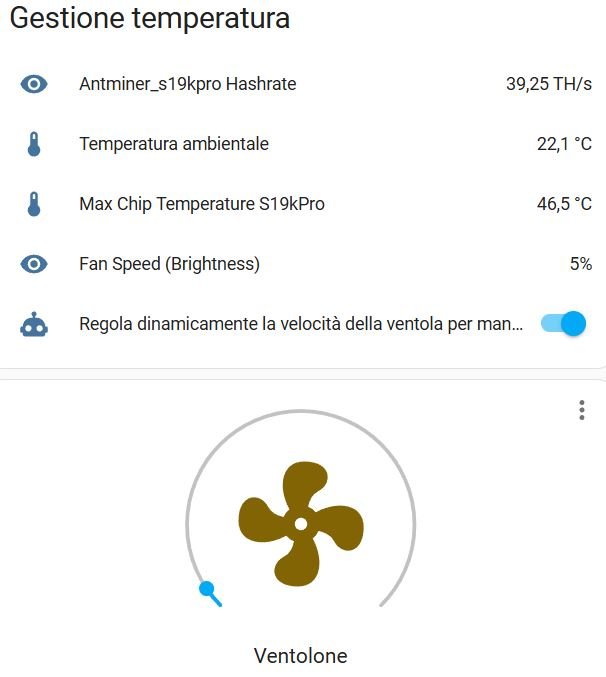

# 🏡HomeMiningAssistant

**Automazione del mining con Home Assistant e fotovoltaico**

HomeMiningAssistant è un progetto per ottimizzare il mining di Bitcoin **utilizzando l'energia in esubero dai pannelli fotovoltaici**, trasformando il calore dissipato dall’ASIC in riscaldamento per la casa. Il tutto viene gestito automaticamente con **Home Assistant**.

---

## 🚀Funzionalità

**Automazione completa** del mining e della ventilazione con Home Assistant  
**Integrazione con impianti fotovoltaici** per sfruttare solo l’energia in esubero.  
Uso di una **ventola da 200 mm** con convogliatore stampato in 3D per migliorare il raffreddamento e ridurre il rumore.

---

##  🛠️Requisiti

### Hardware
- ASIC per il mining di Bitcoin (ad esempio S19)
- Ventola da 200 mm con convogliatore stampato in 3D 
- Sensori di temperatura (opzionale per migliorare l’automazione)
- Raspberry Pi o altro dispositivo per eseguire Home Assistant
- Impianto fotovoltaico con sistema di monitoraggio della produzione

### Software
- Home Assistant
- Integrazione con il sistema di monitoraggio del fotovoltaico (es. Shelly, Victron, Tasmota...)
- Custom automation per la gestione dell'ASIC e della ventola

---
### Firmware ASIC
Per questo test è stato utilizzato il firmware di [Braiins](https://braiins.com/os-firmware) su un Antminer S19k Pro. E' stato scelto questo firmware perché consente la modalità cosiddetta *immersion mode* che consente di staccare fisicamente le ventole senza far andare in protezione il miner. Inoltre grazie ad [hass-miner](https://github.com/Schnitzel/hass-miner) risulta integrabile su Home Assistant.

---
### Preparare la ventola
Per questo esempio è stata utilizzato un estrattore assiale da 200 mm con controller manuale che per comodità chiameremo *ventolone* [Link](https://amzn.to/4gHcs22).<br>
<table align="center">
  <tr>
    <td align="center">
      <br>
      <small>Ventolone da 200mm</small>
    </td>
    <td align="center">
      <br>
      <small>Potenziometro manuale</small>
    </td>
  </tr>
</table>

Il controller manuale è stato automatizzato sostituendolo con un potenziometro domotico [Shelly Plus Dimmer 0-10 DC](https://amzn.to/4hUtlak).<br> 
Il comando manuale è un semplice potenziometro, per sostituirlo basta aprirlo, tagliare i cavi e metterli nello Shelly. Il cavo rosso andrà nel "-" mentre il bianco nel "+".<br>
Ovviamente lo shelly va alimentato con la tensione di 230V e si consiglia di usare una linea indipendente che rimane sempre alimentata.<br>

<table align="center">
  <tr>
    <td align="center">
      <br>
      <small>Interno del potenziometro</small>
    </td>
    <td align="center">
      <br>
      <small>Collegamento Shelly</small>
    </td>
  </tr>
</table>
Configura il dispositivo nell'app "Shelly Smart Control" chiamandolo "Ventola", ma sappi che nella logica dell'app il nuovo dispositivo viene interpretato come se fosse una lampadina dimmerabile.<br> 
Vai nelle impostazioni del dispositivo e modifica:

- **Impostazioni di ingresso/uscita** > Action on power on > configura il dispositivo Shelly per ripristinare l'ultima modalità in cui si trovava, quando è alimentato.
- **Luminosità minima con attivazione/disattivazione** > 100.
- **Luminosità minima/massima** > nel campo valore minimo bisogna inserire il valore minimo che la ventola supporta senza fermarsi, può variare da ventola a ventola. Il valore 10 generalemte è sufficiente.

Adesso la ventola risulterà comandabile da remoto attraverso l'app Shelly.
<table align="center">
  <tr>
    <td align="center">
      <br>
      <small>Interfaccia app per gestire il ventolone</small>
    </td>
  </tr>
</table>

---
### Integrazione con Home Assistant
Una volta installata l'integrazione [hass-miner](https://github.com/Schnitzel/hass-miner) aggiungiamo il nostro dispositivo, in questo caso `Antminer_s19kpro`. Ci accorgeremo che c'è una temperatura per i chip di ogni hashboard, ma a noi interessa solo quella più alta, quindi andiamo a creare un sensore virtuale che ci restituisce solo il valore massimo.<br>
Apriamo il file `configuration.yaml` e aggiungiamo il sensore ricordando di sostituire `antminer_s19kpro` con il nome che avete assegnato al vostro dispositivo:
```yaml
sensor:
  - platform: template
    sensors:
      max_chip_temperature_s19kpro: # Nome del sensore, attenzione alle maiuscole e agli spazi
        friendly_name: "Max Chip Temperature S19kPro" # Nome visualizzato nella dashboard
        unit_of_measurement: "°C"
        value_template: >
          {{ [
              states('sensor.antminer_s19kpro_board_0_chip_temperature') | float(0), 
              states('sensor.antminer_s19kpro_board_1_chip_temperature') | float(0),
              states('sensor.antminer_s19kpro_board_2_chip_temperature') | float(0)
             ] | max }}
        icon_template: mdi:thermometer
```
Adesso dobbiamo creare un sensore che faccia comandare il ventolone come se fosse una luce dimmerabile. Nel codice ho incluso `sensor` solo per comodità, ma in realtà tutti i sensori andranno sotto un unico `sensor` stando attenti a come viene incolonnato il codice.<br>
Attenzione al nome che viene assegnato allo Shelly: in questo caso è `shellyplus010v_cc7b5c88a905` ma il vostro sarà per forza diverso.
```yaml
sensor:
  - platform: template
    sensors:
      fan_speed:
        friendly_name: "Fan Speed (Brightness)" # La velocità verrà trattata come un'intensità di luce
        unit_of_measurement: "%"
        value_template: >
          
            {{ (states.light.shellyplus010v_cc7b5c88a905_light_0.attributes.brightness / 255 * 100) | round(0) }}
          
            0
          
```

Adesso passiamo all'automazione vera e propria.
Questa automazione ha diverse funzioni:

- Viene impostata una temperatura target di 65°C e la ventola si regolerà di conseguenza per tenere sempre quella temperatura
- Se la temperatura dei chip supera i 68°C (temperatura critica) la ventola passa in automatico al massimo della velocità sino a quando non scende sotto la soglia.
- La ventola non scenderà mai sotto il 5% della velocità

Per determinare la velocità minima bisogna fare il calcolo `(255/100)*temperatura_minima` ed arrotondare per eccesso al numero intero.<br>
Esempio: per impostare una velocità del 10% dovete fare `(255/100)*10=25.5` quindi il valore che andrò ad inserire sarà `26`.<br>


```yaml
automation:
  - alias: "Regola dinamicamente la velocità della ventola per mantenere 65°C"
    description: "Adatta la velocità della ventola per mantenere la temperatura a 65°C, ma va al 100% se la temperatura supera i 68°C"
    trigger:
      - platform: state
        entity_id: sensor.max_chip_temperature_s19kpro # Verificare il nome della tua entità
    condition: []
    action:
      - variables:
          current_temp: "{{ states('sensor.max_chip_temperature_s19kpro') | float(0) }}" # Verificare il nome della tua entità
          target_temp: 65 # Valore del target tella temperatura, può essere modificato
          max_speed: 255
          min_speed: 13 # Velocità minima
          current_speed: "{{ state_attr('light.shellyplus010v_cc7b5c88a904_light_0', 'brightness') | float(50)  # Verificare il nome della tua entità
      - service: notify.notify
        data:
          message: >
            Temperatura attuale: {{ current_temp }},
            Velocità corrente: {{ current_speed }},
            Nuova velocità calcolata: >
              {{ [(current_speed - ((target_temp - current_temp) * 5)) | int, min_speed] | max }}
      - choose:
          # Se la temperatura è critica (> 68°C), imposta la ventola al massimo (100%)
          - conditions:
              - condition: template
                value_template: "{{ current_temp > 68 }}" # potete cambiare il 68 con la vostra temperatura critica
            sequence:
              - service: light.turn_on
                target:
                  entity_id: light.shellyplus010v_cc7b5c88a904_light_0 # Verificare il nome della tua entità
                data:
                  brightness: "{{ max_speed }}"
          # Se la temperatura è sopra il target ma inferiore a 68°C, aumenta la velocità
          - conditions:
              - condition: template
                value_template: "{{ current_temp > target_temp and current_temp <= 68 }}"
            sequence:
              - service: light.turn_on
                target:
                  entity_id: light.shellyplus010v_cc7b5c88a904_light_0 # Verificare il nome della tua entità
                data:
                  brightness: >
                    {{ [(current_speed + ((current_temp - target_temp) * 5)) | int, max_speed] | min }}
          # Se la temperatura è sotto il target, diminuisci la velocità
          - conditions:
              - condition: template
                value_template: "{{ current_temp < target_temp }}"
            sequence:
              - service: light.turn_on
                target:
                  entity_id: light.shellyplus010v_cc7b5c88a904_light_0 # Verificare il nome della tua entità
                data:
                  brightness: >
                    {{ [(current_speed - ((target_temp - current_temp) * 5)) | int, min_speed] | max }}
    mode: single
```
Arrivati a questo punto vi consiglio la creazione di una dashboard personalizzata dove potete anche attivare o disattivare l'automazione e controllare la ventola:
<table align="center">
  <tr>
    <td align="center">
      <br>
      <small>Dashboard personalizzata per controllo ventolone</small>
    </td>
  </tr>
</table>

---
## 📷Foto e Modelli 3D
 Aggiungi immagini del setup e link ai modelli 3D per il convogliatore della ventola.

---

## 📜Licenza
Questo progetto è rilasciato sotto la licenza **MIT**. Consulta il file [LICENSE](LICENSE) per maggiori dettagli.

---

##  🔗Link Utili
- [Home Assistant](https://www.home-assistant.io/)

---

##  Contributi e Feedback
I contributi sono benvenuti! Se hai suggerimenti o vuoi migliorare il progetto, apri una **issue** o un **pull request** su GitHub.

---

🚀 **Massimizza il mining, scalda la casa** ⚡
